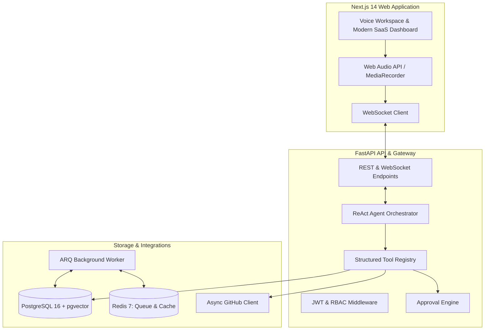

# VoiceOps — Agentic Voice-Based DevOps Engineer

> **VoiceOps** is a production-quality, voice-first AI platform that allows software engineers to investigate GitHub deployments, analyze CI/CD failures, search technical documentation using pgvector RAG, and execute safe, approved engineering actions through natural voice conversations.

---

## ⚡ Key Capabilities

- **🎙️ Real-Time Voice Intelligence**: Live microphone audio capture with equalizer waveform visualizer, streaming speech-to-text (Whisper/Deepgram), natural text-to-speech (OpenAI/ElevenLabs), and full audio interruption cancellation.
- **🔍 Intelligent CI/CD Failure Diagnostics**: Automated inspection of GitHub Actions workflow runs, ANSI log cleaning, stack trace extraction, and commit diff comparisons to pinpoint exact root causes.
- **📚 Documentation RAG with pgvector**: Ingest Markdown runbooks, architecture text, and PDFs into PostgreSQL `pgvector` with hybrid cosine similarity search and verifiable citation cards.
- **🛡️ Human-in-the-Loop Safe Approvals**: Destructive and write operations (`create_issue`, `create_pull_request`) pause agent execution, emit cryptographic approval tokens, and require explicit confirmation via UI cards or voice.
- **🧠 Stateful Multi-Turn Agent Orchestrator**: Persistent conversation memory tracking active repositories, workflow runs, intent, and entities across turns.
- **🔒 Enterprise Security & RBAC**: JWT authentication, HTTP-only refresh cookies, Fernet-encrypted GitHub tokens at rest, and workspace role-based permissions (`Owner`, `Admin`, `Developer`, `Viewer`).

---

## 🏗️ Architecture Overview



---

## 🚀 Quick Start (Docker Compose)

### 1. Clone & Configure Environment
```bash
git clone https://github.com/shivamsharma/VoiceOps.git
cd VoiceOps

# Copy environment template
cp .env.example .env
```

Edit `.env` and fill in your OpenAI, Gemini, or GitHub API credentials if available (VoiceOps includes fallback modes for offline exploration).

### 2. Start Full Stack
```bash
docker compose up --build
```

Services will start at:
- **Web App**: [http://localhost:3000](http://localhost:3000)
- **FastAPI Backend**: [http://localhost:8000](http://localhost:8000)
- **Interactive API Docs**: [http://localhost:8000/docs](http://localhost:8000/docs)
- **PostgreSQL + pgvector**: `localhost:5432`
- **Redis**: `localhost:6379`

---

## 🛠️ Local Development (Without Docker)

### Backend Setup (FastAPI)
```bash
cd apps/api
python3 -m venv .venv
source .venv/bin/activate
pip install -r requirements.txt

# Run migrations
alembic upgrade head

# Start API server
uvicorn app.main:app --host 0.0.0.0 --port 8000 --reload
```

### Frontend Setup (Next.js)
```bash
cd apps/web
npm install
npm run dev
```

---

## 🧪 Testing

### Backend Unit & Integration Tests
```bash
cd apps/api
PYTHONPATH=. .venv/bin/pytest -v
```

### Frontend Typecheck & Build
```bash
cd apps/web
npm run build
```

---

## 📂 Repository Structure

```text
VoiceOps/
├── .env.example
├── docker-compose.yml
├── apps/
│   ├── api/
│   │   ├── Dockerfile
│   │   ├── requirements.txt
│   │   ├── pyproject.toml
│   │   ├── alembic/
│   │   └── app/
│   │       ├── main.py
│   │       ├── core/       # Security, DB, Redis, Config, Logging
│   │       ├── models/     # 14 SQLAlchemy Async Models + pgvector
│   │       ├── schemas/    # Pydantic v2 validation contracts
│   │       ├── api/v1/     # REST and WebSocket Routers
│   │       ├── agents/     # Orchestrator, Prompts, State, LLM Providers
│   │       ├── tools/      # GitHub & RAG tools registry
│   │       ├── github/     # Async GitHub client & Log parser
│   │       ├── rag/        # Parsers, TextChunker, pgvector Retriever
│   │       ├── voice/      # STT and TTS provider abstractions
│   │       └── workers/    # ARQ background tasks
│   │   └── tests/          # Pytest unit & integration test suite
│   │
│   └── web/
│       ├── Dockerfile
│       ├── package.json
│       ├── tailwind.config.ts
│       ├── app/            # Next.js App Router (Landing, Workspace, Dashboard)
│       ├── components/     # Voice visualizer, Activity steps, Approval cards
│       ├── hooks/          # useVoiceRecorder, useWebSocketConversation
│       └── lib/            # API client and utilities
│
├── packages/
│   └── shared/             # Shared TypeScript type definitions
└── docs/                   # Architecture and API specifications
```

---

## 🛡️ Security & Guardrails

1. **No Arbitrary Shell Execution**: The AI agent is strictly bound to structured tool schemas and never evaluates arbitrary shell commands or code.
2. **Encrypted Credentials**: Tokens are encrypted using symmetric Fernet encryption (AES-128-CBC + HMAC-SHA256) before storing in PostgreSQL.
3. **Approval Flow**: Any state-changing write action (opening issues, submitting PRs) creates a pending database record and requires user approval.
4. **No Chain-of-Thought Leakage**: The agent presents high-level activity steps (`agent.activity.step`) to the UI without leaking raw prompt reasoning.

---

## 📄 License
MIT License.
