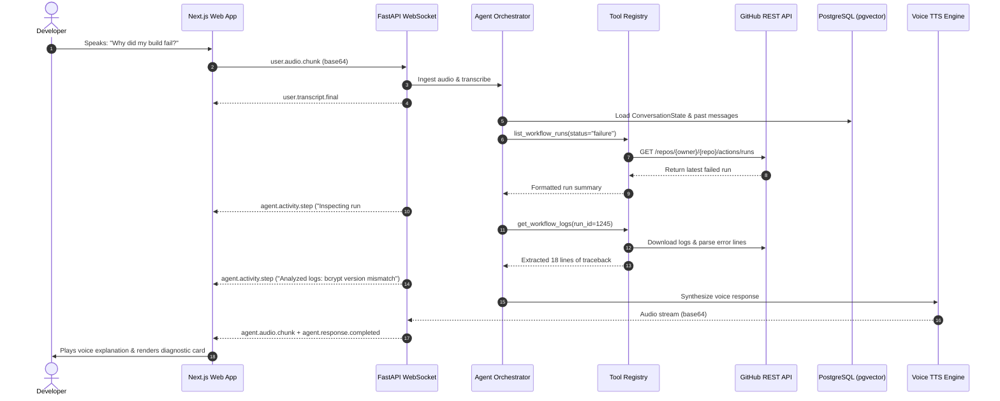

# VoiceOps System Architecture & Technical Specifications

## 1. Executive Summary

VoiceOps is designed around an event-driven, multi-tier architecture separating real-time voice streaming from agentic reasoning, document vector indexing, and asynchronous background tasks.

---

## 2. Component Layers

### 2.1 Frontend Client (`apps/web`)
- **Next.js 14 App Router**: Provides server-side rendering, layout nesting, and fast route transitions.
- **Audio Engine**:
  - `AudioContext` and `AnalyserNode` for capturing live frequency bins and rendering animated equalizer waveforms.
  - `MediaRecorder` for slicing microphone audio into webm/PCM chunks streamed over WebSocket.
- **WebSocket Consumer**: Bi-directional communication channel managing events:
  - `user.audio.chunk`, `user.text.message`, `user.interrupt`, `user.approval.response`
  - `agent.state.changed`, `agent.activity.step`, `agent.tool.started`, `agent.tool.completed`, `agent.approval.required`, `agent.response.completed`, `agent.audio.chunk`, `agent.sources`.

### 2.2 API & Gateway (`apps/api`)
- **FastAPI**: Handles high-performance asynchronous HTTP and WebSocket connections.
- **Security Middleware**: Validates JWT access tokens in headers/cookies and applies sliding window rate limits via Redis.
- **RBAC Dependency Injection**: Enforces role hierarchy (`owner`, `admin`, `developer`, `viewer`) on all workspace and project routes.

### 2.3 Agent Orchestration & State Graph (`app/agents`)
- **ReAct Planner**: Executes multi-turn tool loops with maximum iteration boundaries.
- **Conversation State Manager**: Persists session entity pointers in `conversation_states` table:
  - `active_repo`, `active_workflow_id`, `active_run_id`, `active_pr_id`, `active_issue_id`, `intent`, `entities_json`.
- **Approval Engine**: Enforces two-phase commit pattern for state-changing tools (`create_issue`, `create_pull_request`). Generates signed approval records with 15-minute expiration.

### 2.4 RAG Engine & Vector Search (`app/rag`)
- **Parsers**: Markdown (hierarchy aware), Plain Text, and PDF.
- **TextChunker**: Context-preserving recursive character splitter with configurable token size and sliding overlap.
- **Embeddings**: `text-embedding-3-small` (1536 dims) or deterministic unit-norm fallback.
- **pgvector Storage**: `document_chunks` table indexed with HNSW cosine distance (`vector_cosine_ops`).

---

## 3. Data Flow Diagrams

### 3.1 Voice Investigation & Tool Execution Flow

